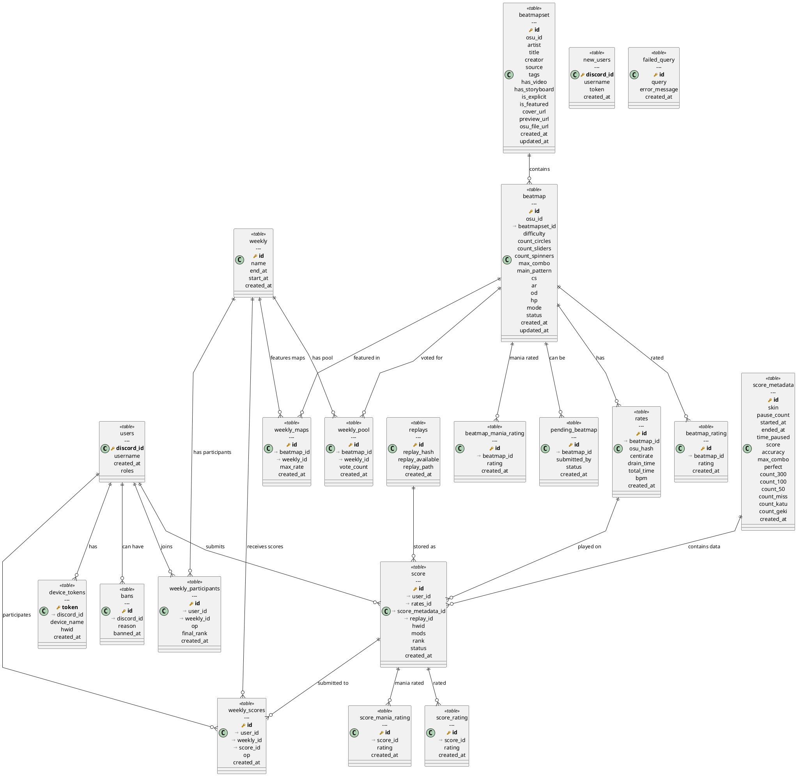

# Database Migrations

This directory contains database migration files for the osu! backend rewrite project. This is a **git submodule** that manages the database schema and structure.

## Overview

The migrations are organized chronologically and cover the following main areas:

- **User Management**: Users, device tokens, bans, and registration validation
- **Beatmap System**: Beatmapsets, beatmaps, and difficulty rates
- **Scoring System**: Scores, replays, and score metadata
- **Rating System**: Performance ratings and mania-specific ratings
- **Weekly Events**: Weekly competitions, pools, and participant tracking

## Migration Files

| File | Description | Tables Created |
|------|-------------|----------------|
| `20250918124221_failed_query.sql` | Failed query tracking | `failed_query` |
| `20250918124247_beatmapset.sql` | Beatmap collections | `beatmapset` |
| `20250918124259_beatmap.sql` | Individual beatmaps | `beatmap` |
| `20250918124404_rates.sql` | Beatmap difficulty rates | `rates` |
| `20250918125942_rating.sql` | Performance ratings | `beatmap_rating`, `score_rating` |
| `20250918125945_maniarating.sql` | Mania-specific ratings | `beatmap_mania_rating`, `score_mania_rating` |
| `20250918133203_pendingbeatmap.sql` | Pending beatmap submissions | `pending_beatmap` |
| `20250918133522_users.sql` | User management system | `users`, `device_tokens`, `bans`, `new_users` |
| `20250918133629_scores.sql` | Scoring system | `score`, `score_metadata`, `replays` |
| `20250918133924_scores_ratings.sql` | Score rating relationships | Rating associations |
| `20250918134308_weekly.sql` | Weekly competition system | `weekly`, `weekly_pool`, `weekly_maps`, `weekly_scores`, `weekly_participants` |

## Database Schema Diagram



## Usage

### Running Migrations

To apply these migrations to your database, use your preferred migration tool (e.g., `sqlx migrate run` or similar):

```bash
# Navigate to the migrations directory
cd migrations

# Run all pending migrations
sqlx migrate run

# Or run a specific migration
sqlx migrate run --source . --target 20250918134308_weekly.sql
```

### Git Submodule Management

Since this is a git submodule, you can manage it independently:

```bash
# Initialize and update the submodule
git submodule init
git submodule update

# Update to the latest version
git submodule update --remote

# Commit changes in the submodule
cd migrations
git add .
git commit -m "Update migrations"
git push

# Update the parent repository to reference the new submodule commit
cd ..
git add migrations
git commit -m "Update migrations submodule"
```

## Database Features

### Key Features

- **Identity Columns**: Uses PostgreSQL's `GENERATED ALWAYS AS IDENTITY` for auto-incrementing primary keys
- **JSONB Support**: Stores complex data like user roles and beatmap patterns as JSON
- **Comprehensive Indexing**: Optimized indexes for common query patterns
- **Data Validation**: Check constraints ensure data integrity
- **Cascade Deletes**: Proper foreign key relationships with appropriate cascade behaviors
- **Timestamps**: Automatic creation and update timestamps on relevant tables

### Performance Considerations

- Indexes are created on frequently queried columns
- Composite indexes for multi-column queries
- Partial indexes for filtered queries (e.g., pending scores)
- JSONB columns for flexible schema evolution

## Contributing

When adding new migrations:

1. Follow the naming convention: `YYYYMMDDHHMMSS_description.sql`
2. Include proper comments with author, description, and version
3. Add appropriate indexes for new tables
4. Update this README with the new migration information
5. Test migrations on a development database before committing

## Notes

- All timestamps use `timestamp default now()`
- Foreign key constraints include appropriate `ON DELETE` actions
- The schema supports both standard osu! modes and mania-specific features
- Weekly competitions include voting, map pools, and ranking systems
- Anti-cheat measures include hardware ID tracking and replay validation
